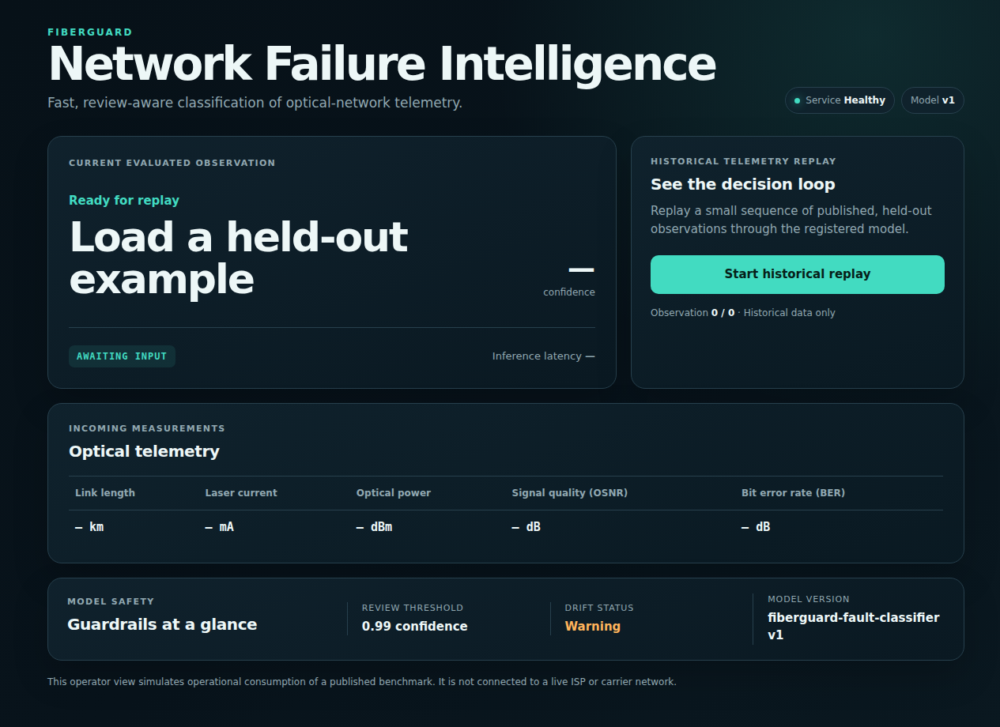
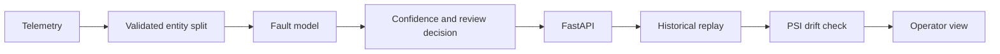

# FiberGuard

### Optical fault classification with a served, monitored model

FiberGuard classifies optical-network degradation from five telemetry measurements. The [audited benchmark](artifacts/data_audit.json) contains 3,628,800 observations across 756 reconstructed lightpaths; XGBoost achieves 99.70% final-test macro-F1 with whole entities held apart. Raw predictions below the validation-selected 0.99 confidence threshold go to human review. FastAPI serves an MLflow-versioned model, with historical replay and PSI drift monitoring.

> **Scope:** FiberGuard is trained and evaluated on a published optical-network telemetry benchmark. Its replay → prediction → review → drift loop simulates operational consumption and is not connected to a live carrier network.



*The dependency-free operator view replays held-out historical telemetry; it does not display live carrier traffic.*

## How it works



Five measurements—link length, laser current, optical power, signal quality, and bit error rate—produce one of four states: **healthy**, **laser degradation (ECL)**, **amplifier degradation (EDFA)**, or **nonlinear impairment (NLI)**. Predictions below 0.99 confidence are marked **NEEDS REVIEW**.

## Why the result is trustworthy

The raw benchmark does not contain a lightpath ID. FiberGuard reconstructs identity from the publisher's ordered four-condition blocks, validates that structure across all 756 lightpaths, and then splits whole lightpaths. Identity depends on the publisher's stable row ordering; there is no independently verified entity-ID column. No reconstructed lightpath appears in more than one of training, validation, or final test. This avoids the optimistic leakage that would result from randomly mixing correlated telemetry rows.

| Evidence | Held-out result |
|:--|--:|
| Dummy classifier macro-F1 | 0.100000 |
| Logistic Regression macro-F1 | 0.989630 |
| XGBoost macro-F1 | **0.996960** |
| XGBoost log loss | **0.010313** |
| XGBoost multiclass Brier score | **0.004794** |

Sources: [baseline evaluation](artifacts/baseline_metrics.json), [production probability metrics](artifacts/production_manifest.json), and [split manifest](artifacts/split_manifest.json). The selected split uses 1,904,400 training rows, 406,800 validation rows, and 136,800 final-test rows (114 held-out lightpaths); the 3.6M figure describes the full audited dataset. The baseline progression shows that the task is learnable with conventional models and that XGBoost adds measurable value. Deep learning was not needed.

Reliability was evaluated rather than assumed. Sigmoid calibration was fitted on validation data and rejected because it worsened log loss and Brier score, so the shipped model keeps raw XGBoost probabilities. The 0.99 review threshold was also selected on validation data only. For the shipped raw model, [validation evidence](artifacts/production_manifest.json) records 2.35005% routed to review and 1,057 of 1,392 errors captured (75.9339%). These are threshold-selection validation results. The 0.52485% review / 267-of-441 final-test result in [calibration metrics](artifacts/calibration_metrics.json) belongs to the rejected sigmoid experiment. A full final-test review result for the shipped raw model has not been persisted; it cannot be inferred from that experiment.

Feature ablation checks whether one convenient signal explains the score:

| Features | Final-test macro-F1 |
|:--|--:|
| All five | **0.996960** |
| Without laser current | 0.746982 |
| Without optical power | 0.868202 |

[Feature ablation](artifacts/feature_ablation.json) shows no single feature reproduced full performance. Removing length, OSNR, or BER barely changed the score; laser current and optical power contribute most. Ablation is diagnostic, not final-test model selection.

## Production loop

- **Versioned model:** MLflow tracks and registers `fiberguard-fault-classifier` version 1.
- **Inference service:** FastAPI exposes `GET /health` and `POST /predict`, returning state, confidence, review decision, model version, and latency.
- **Historical replay:** a deterministic held-out sample exercises the production inference path without implying a live data feed. Measured in-process replay latency was 0.306 ms p50 and 4.682 ms p95 in the [recorded 4,560-row run](artifacts/historical_replay.json). These local, in-process timings exclude HTTP overhead and are run-specific.
- **Drift monitoring:** PSI compares replay telemetry with training-lightpath reference bins. Representative publisher test data genuinely differs from training; this is a benchmark distribution shift, not a production incident. LP-power PSI was 2.724334, while a controlled +2.0 dBm injection raised it to 9.777087 using the same 0.20 warning threshold.
- **Operator interface:** `GET /` explains model health, current telemetry, likely fault, confidence, review routing, latency, drift, and model version in one view.

PSI evidence: [drift validation](artifacts/drift_validation.json). The supporting results are committed as compact artifacts, including the data audit, entity-safe split manifest, baseline metrics, calibration metrics, feature ablation, production manifest, and drift validation.

## Reproduce

Place the two publisher files under `data/raw/Optical network soft failure dataset/`. The audited local benchmark is titled **Optical network soft failure dataset** and contains `Lightpath_756_label_4_QoT_dataset_train_900.txt` and `Lightpath_756_label_4_QoT_dataset_test_300.txt`. Its bundled metadata provides the four-state label mapping but no verified author list, DOI, or canonical publisher URL.

```bash
# Install
python3 -m venv .venv
source .venv/bin/activate
pip install -e ".[test]"

# Rebuild audits, evaluation, and registered model only when needed
PYTHONPATH=src python3 scripts/audit_data.py
PYTHONPATH=src python3 scripts/train_baselines.py
PYTHONPATH=src python3 scripts/evaluate_reliability.py
PYTHONPATH=src python3 scripts/productionize.py

# Run the product loop
PYTHONPATH=src uvicorn fiberguard.api:app --host 127.0.0.1 --port 8000
PYTHONPATH=src python3 scripts/replay_telemetry.py
PYTHONPATH=src python3 scripts/validate_drift.py
PYTHONPATH=src python3 -m unittest discover -s tests
```

Raw data, the MLflow database, and model binaries are not committed. Regenerate the registry with `productionize.py` before serving; the public manifest alone is not a runnable model. Its local paths resolve from the repository root.

Open `http://127.0.0.1:8000/` for the operator view. All reported final-test metrics remain held-out evaluation only.
