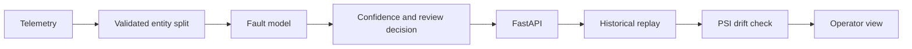

# FiberGuard

### Production ML for Network Reliability

FiberGuard demonstrates how an ML system could help network operators identify soft degradation in optical connections, determine the likely fault, and route ambiguous predictions for review rather than blindly automating every decision.

> **Scope:** FiberGuard is trained and evaluated on a published optical-network telemetry benchmark. Its replay → prediction → review → drift loop simulates operational consumption and is not connected to a live carrier network.


*The dependency-free operator view replays held-out historical telemetry; it does not display live carrier traffic.*

| **3.6M** | **756** | **99.70%** | **≈61%** |
|:--|:--|:--|:--|
| telemetry observations | inferred fiber links | macro-F1 on held-out links | model errors captured while reviewing ≈0.52% of cases |

## How it works



Five measurements—link length, laser current, optical power, signal quality, and bit error rate—produce one of four states: **healthy**, **laser degradation (ECL)**, **amplifier degradation (EDFA)**, or **nonlinear impairment (NLI)**. Predictions below 0.99 confidence are marked **NEEDS REVIEW**.

## Why the result is trustworthy

The raw benchmark does not contain a lightpath ID. FiberGuard reconstructs identity from the publisher's ordered four-condition blocks, validates that structure across all 756 lightpaths, and then splits whole lightpaths. No reconstructed lightpath appears in more than one of training, validation, or final test. This avoids the optimistic leakage that would result from randomly mixing correlated telemetry rows.

| Evidence | Held-out result |
|:--|--:|
| Dummy classifier macro-F1 | 0.100000 |
| Logistic Regression macro-F1 | 0.989630 |
| XGBoost macro-F1 | **0.996960** |
| XGBoost log loss | **0.010313** |
| XGBoost multiclass Brier score | **0.004794** |

The baseline progression shows that the task is learnable with conventional models and that XGBoost adds measurable value. Deep learning was not needed.

Reliability was evaluated rather than assumed. Sigmoid calibration was fitted on validation data and rejected because it worsened log loss and Brier score, so the shipped model keeps raw XGBoost probabilities. The 0.99 review threshold was also selected on validation data only. On the untouched final test, it routed about 0.52% of cases to review, captured 267 of 441 model errors, and left confident predictions at about 99.87% accuracy. These are evaluation results, not a formal coverage guarantee.

Feature ablation checks whether one convenient signal explains the score:

| Features | Final-test macro-F1 |
|:--|--:|
| All five | **0.996960** |
| Without laser current | 0.746982 |
| Without optical power | 0.868202 |

No single feature reproduced full performance; the classifier depends on complementary telemetry signals.

## Production loop

- **Versioned model:** MLflow tracks and registers `fiberguard-fault-classifier` version 1.
- **Inference service:** FastAPI exposes `GET /health` and `POST /predict`, returning state, confidence, review decision, model version, and latency.
- **Historical replay:** a deterministic held-out sample exercises the production inference path without implying a live data feed. Measured in-process replay latency was approximately 0.27 ms p50 and 0.76 ms p95.
- **Drift monitoring:** PSI compares replay telemetry with training-lightpath reference bins. Representative publisher test data genuinely differs from training; this is a benchmark distribution shift, not a production incident. LP-power PSI was 2.724334, while a controlled +2.0 dBm injection raised it to 9.777087 using the same 0.20 warning threshold.
- **Operator interface:** `GET /` explains model health, current telemetry, likely fault, confidence, review routing, latency, drift, and model version in one view.

The supporting results are committed as compact artifacts, including the data audit, entity-safe split manifest, baseline metrics, calibration metrics, feature ablation, production manifest, and drift validation.

## Design decisions and non-goals

- **No deep learning:** conventional models already performed strongly, so extra complexity was not justified.
- **No Kafka or Kubernetes:** bounded historical replay is sufficient to demonstrate this benchmark V1's consumption loop.
- **No live-carrier claim:** the interface is an operational simulation over published historical data.
- **No complexity for a vanity score:** the goal is a defensible 99.70% held-out result, not chasing 99.9% with an unnecessary model stack.

## Reproduce

Place the two publisher files under `data/raw/Optical network soft failure dataset/`. The audited local benchmark is titled **Optical network soft failure dataset** and contains `Lightpath_756_label_4_QoT_dataset_train_900.txt` and `Lightpath_756_label_4_QoT_dataset_test_300.txt`. Its bundled metadata provides the four-state label mapping but no verified author list, DOI, or canonical publisher URL.

```bash
# Install
python3 -m venv .venv
source .venv/bin/activate
pip install -e .

# Rebuild audits, evaluation, and registered model only when needed
PYTHONPATH=src python3 scripts/audit_data.py
PYTHONPATH=src python3 scripts/train_baselines.py
PYTHONPATH=src python3 scripts/evaluate_reliability.py
PYTHONPATH=src python3 scripts/productionize.py

# Run the product loop
PYTHONPATH=src uvicorn fiberguard.api:app --host 127.0.0.1 --port 8000
PYTHONPATH=src python3 scripts/replay_telemetry.py
PYTHONPATH=src python3 scripts/validate_drift.py
PYTHONPATH=src python3 -m unittest discover -s tests
```

Open `http://127.0.0.1:8000/` for the operator view. All reported final-test metrics remain held-out evaluation only.
